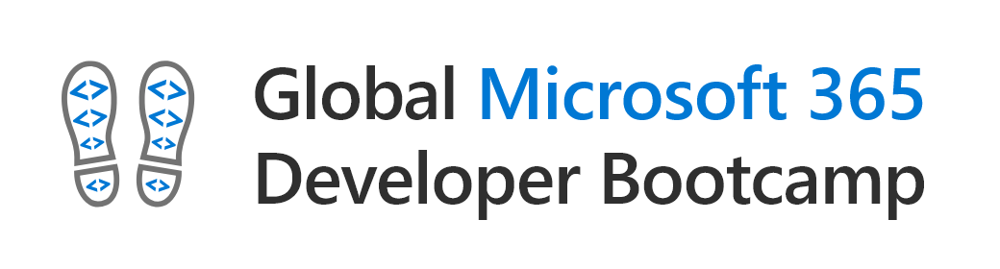
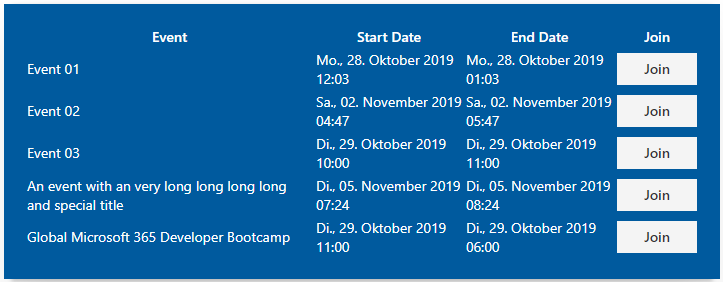

# SharePoint Framework - WebPart Tutorial

Das Lab zeigt die Entwicklung eines WebParts, dem Event list WebPart, mit dem SharePoint Framework.

## Labs

### [Lab 1 - Getting Started](./docs/spfx-lab-1.md)
### [Lab 2 - Lokales entwicklen](./docs/spfx-lab-2.md)
### [Lab 3 - In SharePoint entwickeln](./docs/spfx-lab-3.md)
### [Lab 4 - Deployment](./docs/spfx-lab-4.md)
### [Lab 5 - Microsoft Graph - Termin erstellen](./docs/spfx-lab-5.md)
### [Lab 6 - Office UI Fabric](./docs/spfx-lab-6.md)
### [Lab 7 - Build-Process erweitern](./docs/spfx-lab-7.md)
### [EXTRA: Lab 8 - SPFx WebPart in Microsoft Teams](./docs/spfx-lab-8.md)

##  Abgeschlossenes Projekt

Das fertige Projekt zu diesem Lab findest du im Ordner [`eventListWebPart`](./src/eventListWebPart).

## Teams Bot Lab (by Christian Glessner)

### https://github.com/ltwlf/microsoft-teams-training

## Slides

### https://speakerdeck.com/daniellindemann/global-microsoft-365-developer-bootcamp-2019-sharepoint-framework-berlin
