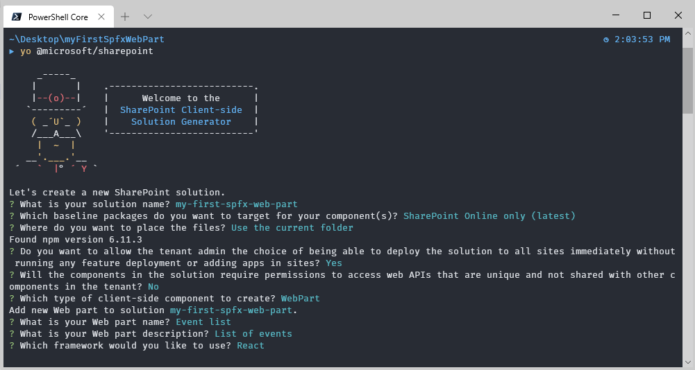
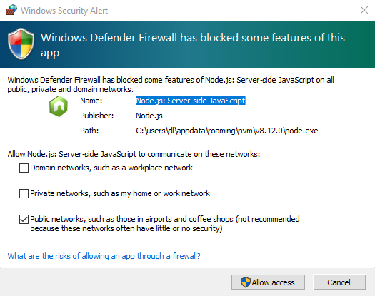
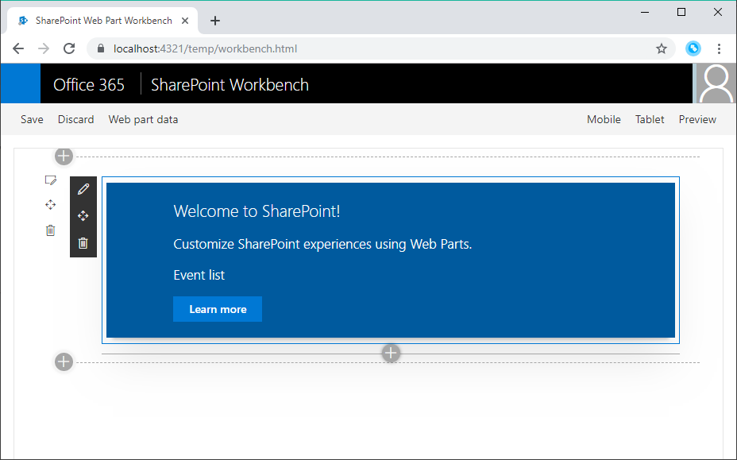

# SharePoint Framework Training
## Lab 1 - Getting Started

## Prerequisites 
- Visual Studio Code (https://code.visualstudio.com/download) or any other editor
- Node v10.* (LTS) (https://nodejs.org/en/)
- Office 365 (Dev) Subscription (https://docs.microsoft.com/en-us/office/developer-program/office-365-developer-program-get-started)
- Prepare your Office 365 Tenant (https://docs.microsoft.com/en-us/sharepoint/dev/spfx/set-up-your-developer-tenant)

## 1. Entwicklungs-Tools installieren

Zum Erstellen von SPFx-Projekten werden die NodeJS-Tools gulp und yeoman benötigt. Für yeoman wird noch der SPFx-Projekt-Generator benötigt.

Öffne eine Konsole und tippe diesen Befehl ein um die Tools zu installieren:

```
npm install -g yo gulp @microsoft/generator-sharepoint
```

## 2. Projekt erstellen

Erstelle einen Ordner und führe in dem Order diesen Befehl aus um ein Projekt zu erstellen:

```
yo @microsoft/sharepoint
```

Erstelle mithilfe von Yeoman nun ein SPFx Projekt mit einem WebPart.



Die Bereitstellung dauert etwas. Lehn dich zurück und schau zu oder hol dir einen Kaffee ☕.

## 3. Erster Build

Nach dem erstellen des Projekt kann geprüft werden, ob alles sauber funktioniert. Tippe dazu den Befehl `gulp serve` in die Konsole ein.

Ist es dein erstes SPFx-Projekt erscheint nun eine Firewall-Meldung. Diese kannst du akzeptieren. NodeJS startet einen Webserver für die lokale Workbench.



Danach öffnet sich der Browser mit der URL `https://localhost:4321/temp/workbench.html`. Hier kann es wiederum sein, dass ein Zertifikatsfehler angezeigt wird. Um den Fehler zu beheben und ein Development-Zertifikat zu installieren muss in der Konsole dieser Befehl einmalig ausgeführt werden:

```
gulp trust-dev-cert
```

Ist das Zertifikat installiert kann mit `gulp serve` wieder die lokale Workbench geöffnet werden.
Wie in SharePoint üblich kann nun der Demo-WebPart in die lokale Workbench hinzugefügt werden.



## 4. Projektstruktur

Ein SPFx-Projekt hat ein spezifische Projektstruktur. Hier ein paar Auszüge für ein besseres Verständnis.

Im Ordner `config` findest du alle Dateien die das Projekt beschreiben. z.B steht in der `package-solution.json`-Datei wie ein Deployment-Package erstellt wird.

Im Ordner `src/webparts` findest du den erstellten WebPart mit allen Abhängigkeiten. Da ein React-SPFx-Projekt erstellt wurde ist neber der `xWebPart.ts`-Datei ein `components`-Ordner mit der React-Komponente, die vom WebPart gerendert wird.


