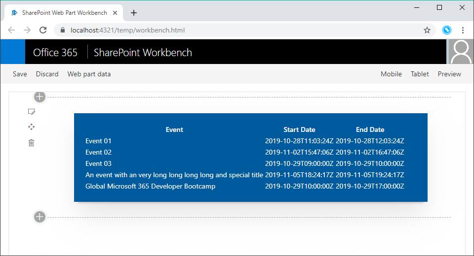

# SharePoint Framework Training
## Lab 2 - Lokales entwicklen

Als Beispiel für die Entwicklung mit dem SPFx wird ein Event List WebPart erstellt. Erstelle ein neues Projekt wie in [Lab 1](./spfx-lab-1.md) beschrieben und nenne den WebPart `Event list`.

## Erstellen der Interfaces und Services

Damit der WebPart in der lokalen Umgebung Daten anzeigen kann, müssen Interfaces und Services zum Mocken von Daten erstellt werden.

### IEventItem.ts

Beschreibt welche Informationen ein Event hat. Ein Event Item hat eine ID, einen Titel, ein Startdatum und ein Enddatum.

Unter dem `src`-Ordner einen neuen Ordner mit dem Namen `interfaces` anlagen und die Datei `IEventItem.ts` darin erstellen.

```typescript
export interface IEventItem {
  ID: number;
  Title: string;
  StartDate: string | Date;
  EndDate: string | Date;
}
```

### IEventsService.ts

Beschreibt einen Service und dessen Methoden um Events zu laden.

Unter dem `src/interfaces`-Ordner eine Datei mit dem Namen `IEventsService.ts` anlegen.

```typescript
import { IEventItem } from './IEventItem';

export interface IEventsService {
  get(): Promise<IEventItem[]>;
}
```

### MockEventsService.ts

Läd Beispiel Events zum anzeigen im WebPart.

Unter dem `src`-Ordner einen neuen Ordner mit dem Namen `services` anlagen und die Datei `MockEventsService.ts` darin erstellen.

```typescript
import { IEventsService } from '../interfaces/IEventsService';
import { IEventItem } from '../interfaces/IEventItem';

export class MockEventsService implements IEventsService {

  private static Items: IEventItem[] = [
    { ID: 1, Title: 'Event 01', StartDate: '2019-10-28T11:03:24Z', EndDate: '2019-10-28T12:03:24Z' },
    { ID: 2, Title: 'Event 02', StartDate: '2019-11-02T15:47:06Z', EndDate: '2019-11-02T16:47:06Z' },
    { ID: 3, Title: 'Event 03', StartDate: '2019-10-29T09:00:00Z', EndDate: '2019-10-29T10:00:00Z' },
    { ID: 4, Title: 'An event with an very long long long long and special title', StartDate: '2019-11-05T18:24:17Z', EndDate: '2019-11-05T19:24:17Z' },
    { ID: 5, Title: 'Global Microsoft 365 Developer Bootcamp', StartDate: '2019-10-29T10:00:00Z', EndDate: '2019-10-29T17:00:00Z' }
  ];

  public get(): Promise<IEventItem[]> {
    return Promise.resolve(MockEventsService.Items);
  }
}
```

## WebPart mit Daten anreichern

Um die Daten aus dem `MockEventsService` anzuzeigen muss die Datei `EventListWebPart.ts` erweitert werden.

### Event Service Instanz
In der Klasse `EventListWebPart` eine Variable mit dem Namen `eventsService` erstellen.

```typescript
private eventsService: IEventsService;
```

Um die `MockEventsService`-Klasse zu instanziieren die Methode `onInit` implementieren und darin der Variable `eventsService` eine Instanz der Klasse `MockEventsService` zuweisen.

```typescript
protected onInit(): Promise<void> {
    this.eventsService = new MockEventsService();

    return Promise.resolve();
}
```

### Informationen aus Event Service an WebPart weitergeben

Dafür muss als erstes das Interface `IEventListProps` aus der Datei `IEventListProps.ts` erweitert werden. Hier fügst du eine neue Property mit dem Namen `items` hinzu. Somit kann die React-Komponente später auf die Daten zugreifen.

```typescript
import { IEventItem } from '../../../interfaces/IEventItem';

export interface IEventListProps {
  description: string;
  items: IEventItem[];
}
```

Im WebPart `EventListWebPart.ts` überschreibst du nun die `render()`-Methode. Hier werden nun zuerst die Daten aus dem Service geladen und danach wird der WebPart gerendert.

```typescript
public render(): void {
  this.eventsService.get()
    .then((events) => {
      Log.info('EventListWebPart', `Got ${events ? events.length : 0} events`, this.context.serviceScope);

      const element: React.ReactElement<IEventListProps > = React.createElement(
        EventList,
        {
          description: this.properties.description,
          items: events
        }
      );

      ReactDom.render(element, this.domElement);
    })
    .catch((err) => {
      this.context.statusRenderer.renderError(this.domElement, err.message ? err.message : 'Unable to get event data');
      Log.warn('EventListWebPart', err.message, this.context.serviceScope);
    });
}
```

### Daten in WebPart ausgeben

Das Anzeigen der Event Daten passiert in der React-Komponente `EventList.tsx` im Ordner `components`. Hierin kann alles innerhalb des `div` mit der Klasse `row` gelöscht werden. Stattdessen fügst du den folgenden Code ein um eine Tabelle mit den Event-Informationen auszugeben.

```typescriptreact
<table>
    <tbody>
        <tr>
            <th>Event</th>
            <th>Start Date</th>
            <th>End Date</th>
        </tr>
        {
            this.props.items && this.props.items.map(item => {
                return <tr key="{item.ID}">
                    <td>{item.Title}</td>
                    <td>{item.StartDate}</td>
                    <td>{item.EndDate}</td>
                </tr>;
            })
        }
    </tbody>
</table>
```

## Testen der Anzeige

Zum Anzeigen der Events um zum Testen in der Konsole `gulp serve` eingeben. Der Browser öffnet sich und der WebPart zeigt eine Tabelle mit Events an (auch wenn nicht in perfekter Schönheit).


