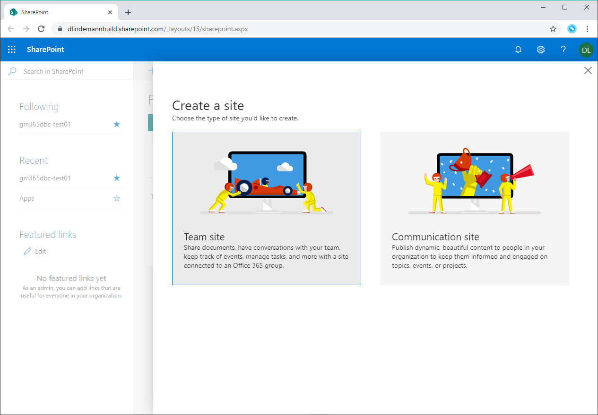
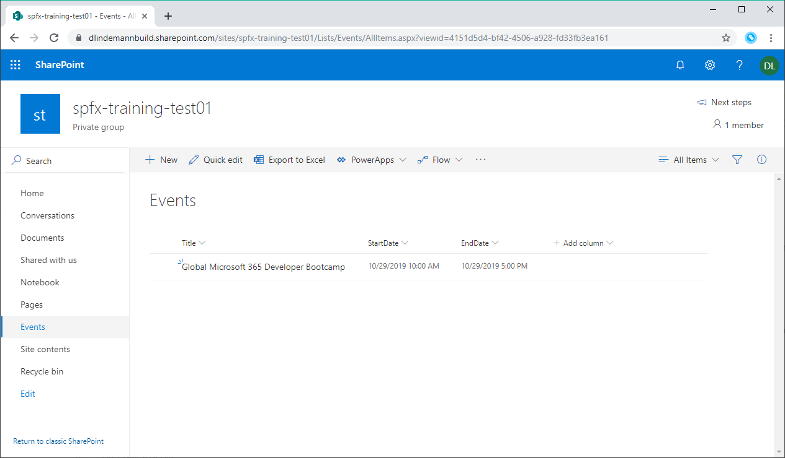
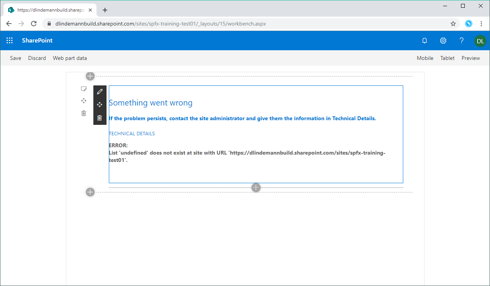
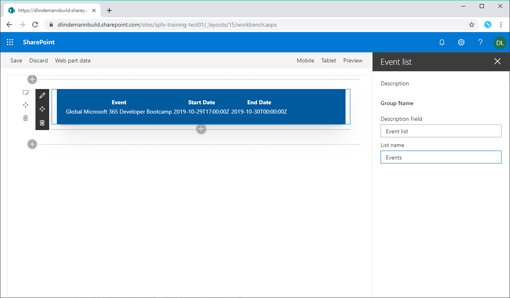

# SharePoint Framework Training
## Lab 3 - In SharePoint entwickeln

Nun wird es Zeit mit echten SharePoint-Daten zu arbeiten. Dafür musst du eine Teamsite und eine Event-Liste in SharePoint anlegen. Danach wird der WebPart erweitert und in der SharePoint-Workbench getestet.

## Erstellen einer SharePoint Teamsite und einer Event-Liste

Gehe auf `https://portal.office.com` und erstelle eine neue Teamsite.



In der Teamsite erstellst du eine neue Liste mit dem Titel `Events`. Füge der Liste diese Felder hinzu:
- `StartDate`, vom Typ Datum mit Uhrzeit
- `EndDate`, vom Typ Datum mit Uhrzeit

Füge in die Liste einen neuen Eintrag hinzu:

| Titel | StartDate | EndDate |
|-------|-----------|---------|
| Global Microsoft 365 Developer Bootcamp | 29.10.2019 10:00 Uhr | 29.10.2019 17:00 Uhr |

Die Liste sollte dann wie auf dem Screenshot aussehen.



## SharePoint Workbench öffnen

Versichere dich, dass du in deiner Konsole noch den Befehl `gulp serve` ausführst. Nun geh in der SharePoint Teamsite auf die URL `https://<deine Teamsite>/_layouts/workbench.aspx`. Daraufhin öffnet sich die SharePoint Workbench. Sie ähnelt sehr der lokalen Workbench mit der Ausnahme, dass du alle SharePoint WebParts hinzufügen kannst.

Die SharePoint Workbench bietet dir auch den WebPart an den du gerade entwickelst. Dazu wird der Code deines WebParts in die SharePoint Website geladen. Füge den Event List WebPart nun in der SharePoint Workbench hinzu.

Das Ergebnis ist identisch zu der lokalen Workbench.

## WebPart mit SharePoint Event-Daten befüllen

Damit zwischen SharePoint und lokaler Entwicklungsumgebung unterschieden wird, erweitest du die Methdode `onInit()` in der Datei `EventListWebPart.ts` und fügst einen neuen Service, den `SPEventsService.ts` zum Ordner `src/services` hinzu. Weiter kommt noch ein Interface mit dem Namen `IEventServiceOptions` um Informationen vom WebPart an den Dienst weiterzureichen. Damit du die Liste aus der die Daten geladen werden dynamisch angeben kannst, erweiterst du noch die Methode `getPropertyPaneConfiguration()` und deren Abhängigkeiten.

### Methode onInit() erweitern
```typescript
protected onInit(): Promise<void> {
  this.eventsService = Environment.type == EnvironmentType.Local ? new MockEventsService() : new SPEventsService(this.context, this.properties);

  return Promise.resolve();
}
```

### Interface IEventListWebPartProps erweitern
```typescript
export interface IEventListWebPartProps {
  description: string;
  listname: string;
}
```

### Methode getPropertyPaneConfiguration() erweitern
```typescript
protected getPropertyPaneConfiguration(): IPropertyPaneConfiguration {
  return {
    pages: [
      {
        header: {
          description: strings.PropertyPaneDescription
        },
        groups: [
          {
            groupName: strings.BasicGroupName,
            groupFields: [
              PropertyPaneTextField('description', {
                label: strings.DescriptionFieldLabel
              }),
              PropertyPaneTextField('listname', {
                label: strings.ListnameFieldLabel
              })
            ]
          }
        ]
      }
    ]
  };
}
```

### mystrings.d.ts erweitern
```typescript
declare interface IEventListWebPartStrings {
  PropertyPaneDescription: string;
  BasicGroupName: string;
  DescriptionFieldLabel: string;
  ListnameFieldLabel: string;
}
```

### en-us.js erweitern
```javascript
define([], function() {
  return {
    "PropertyPaneDescription": "Description",
    "BasicGroupName": "Group Name",
    "DescriptionFieldLabel": "Description Field",
    "ListnameFieldLabel": "List name"
  }
});
```

### SPEventsService.ts
```typescript
import { IEventsService } from '../interfaces/IEventsService';
import { IEventItem } from '../interfaces/IEventItem';
import { WebPartContext } from '@microsoft/sp-webpart-base';
import { SPHttpClient, SPHttpClientResponse } from '@microsoft/sp-http';
import { IEventServiceOptions } from '../interfaces/IEventServiceOptions';

export class SPEventsService implements IEventsService {
  constructor(private context: WebPartContext, private options: IEventServiceOptions) {}

  public get(): Promise<IEventItem[]> {
    const selects = [
      'ID',
      'Title',
      'StartDate',
      'EndDate'
    ];
    const filters = [
      `EndDate ge datetime'${new Date().toISOString()}'`
    ];
    const orders = [
      `StartDate asc`
    ];

    return new Promise<IEventItem[]>((resolve, reject) => {
      this.context.spHttpClient.get(`${this.context.pageContext.web.absoluteUrl}/_api/web/lists/getbytitle('${this.options.listname}')/items?$select=${selects.join()}&$filter=${filters.join(' and ')}&$orderBy=${orders.join(',')}`, SPHttpClient.configurations.v1)
        .then((res: SPHttpClientResponse) => {
          return res.json();
        })
        .then((json) => {
          if(json.error) {
            reject(json.error);
            return;
          }

          resolve(json.value as IEventItem[]);
        });
    });
  }
}
```

## SharePoint-Abfrage mit der REST API
In der Datei `SPEventsService.ts` siehst du wie man eine SharePoint REST API Query ausführt. Dazu benutzt du am einfachsten den REST Client aus dem SPFx.

Weitere Informationen zu der SharePoint REST API findest du hier: https://bit.ly/sprest

## Testen
Öffne die SharePoint Workbench unter `https://<deine Teamsite>/_layouts/workbench.aspx` und füge den WebPart hinzu. Du erhälst zuerst einen Fehler. Das ist normal.



Klicke auf Bearbeiten und schreibe in das Feld `List name` den Namen der Event Liste: `Events`

Wie durch Zauberhand werden nun die Daten aus deiner SharePoint-Liste ausgegeben.



<sub>[Code zum Projekt](../src/lab3)</sub>