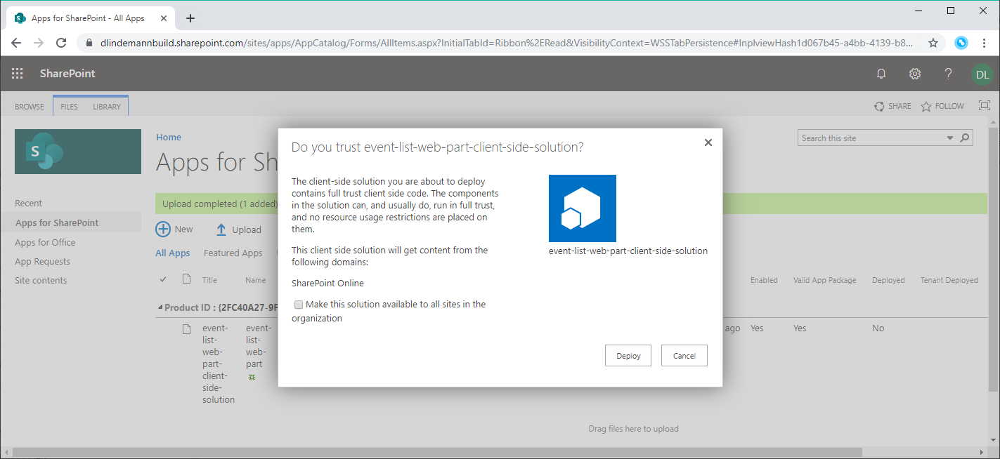
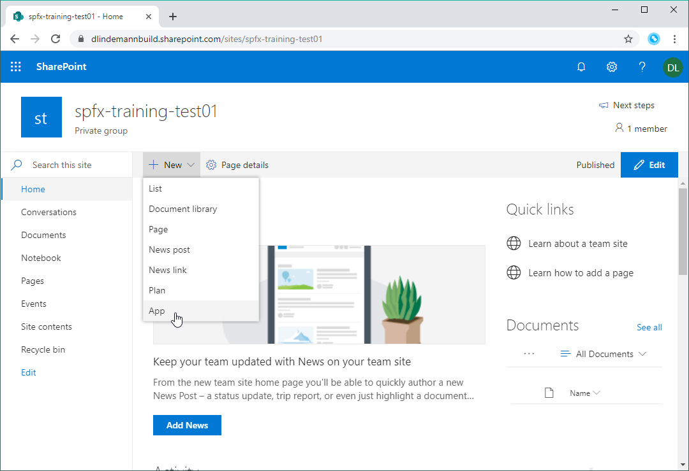
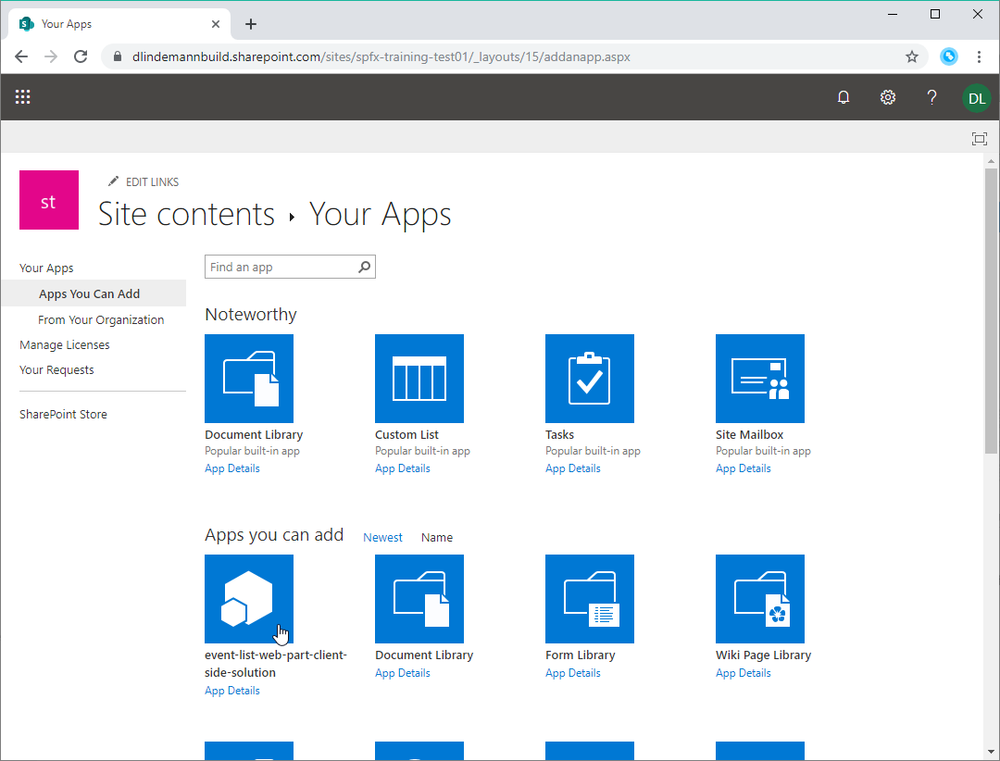
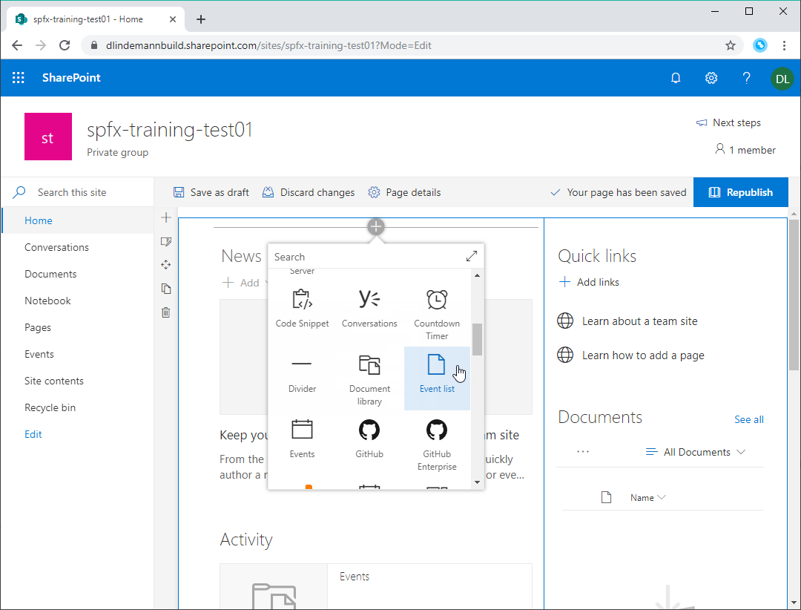

# SharePoint Framework Training
## Lab 4 - Deployment

Der WebPart funktioniert nun auch mit SharePoint-Daten. Also wird es Zeit mal ein Release-Paket zu bauen und zu Deployen.

## Voraussetzung

Bevor ein WebPart deployt werden kann, muss ein App Catalog im Tenant bereitstehen. Eine Anleitung zum Bereitstellen eines App Catalog findest du in den Microsoft Docs: https://docs.microsoft.com/en-us/sharepoint/dev/spfx/set-up-your-developer-tenant#create-app-catalog-site

## Bundle & Package

Um ein Deployment-Paket zu erstellen muss zuerst alles gebundled werden. Dafür führst du in der Konsole diesen Befehl aus:

```
gulp bundle --ship
```

Der Parameter `--ship` sorgt dafür dass eine "Release"-Version ohne unnötigen Debug-Code gebundled wird.

Ist das Bundle erstellt, führst du diesen Befehl aus um eine deploybare SPFx Solution-Datei zu erstellen:
```
gulp package-solution --ship
```

In deinem Projekt findest du jetzt den Ordner `sharepoint/solution`. Darin ist eine `sppkg`-Datei. Das ist dein Deployment-Package.

## CDN aktivieren

Damit die JavaScript-Dateien aus dem Bundle schneller ausgeliefert werden können, sollte das SharePoint CDN aktiviert werden. Das Feature kannst du so aktivieren:

- SharePoint Management Shell installieren (https://www.microsoft.com/en-US/download/details.aspx?id=35588)
- PowerShell öffnen
- `Connect-SPOService https://<tenant>-admin.sharepoint.com` ausführen und einloggen
- Mit `Get-SPOTenantCdnEnabled -CdnType Public` prüfen, ob das CDN-Feature bereits aktiviert ist
- Ist das CDN nicht aktiviert mit `Set-SPOTenantCdnEnabled -CdnType Public` aktivieren
- Die Aktivierung dauert ein paar Minuten. Also ☕.

## Auf SharePoint Teamsite deployen

Gehe mit einem Browser auf die SharePoint Online Admin Seite und wechsele dann auf `More Features > Apps > Open > App Catalog`. Öffne die Liste `Apps for SharePoint`.

Nun lädst du die `sppkg`-Datei in die Bibliothek `Apps for SharePoint` hoch. Du wirst nochmal gefragt, ob du die Solution wirklich deployen willst. Natürlich willst du das 😉.



Wechsele auf deine SharePoint Teamsite und klicke auf `New > App`.



Füge die App `event-list-web-part-client-side-solution` hinzu.



Gehe auf die Startseite und klicke auf Edit. Füge den WebPart `Event list` hinzu und konfigurieren ihn.



That's it 😎.

<sub>[Code zum Projekt](../src/lab4)</sub>