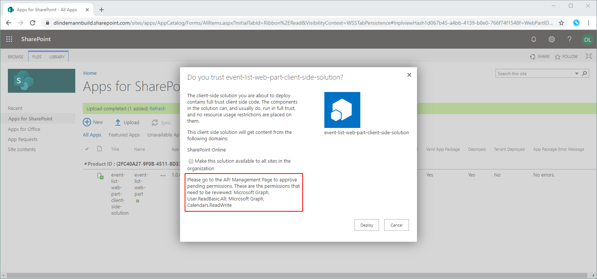
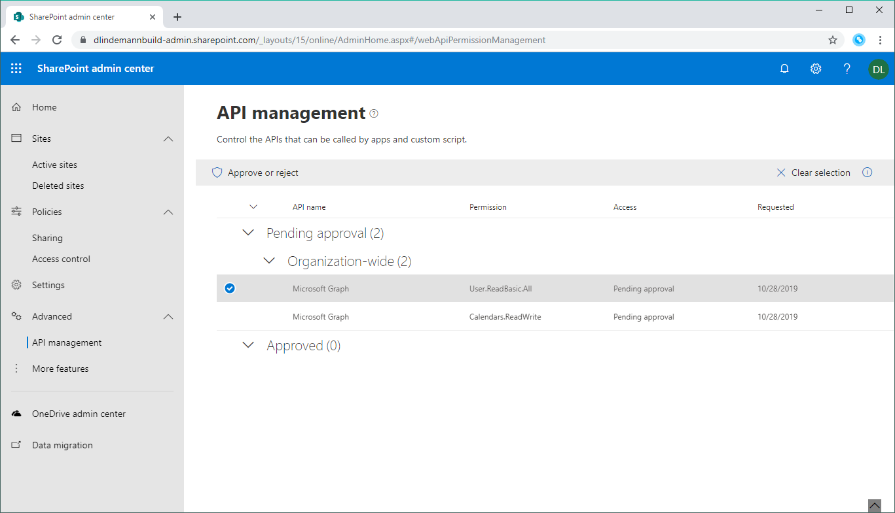
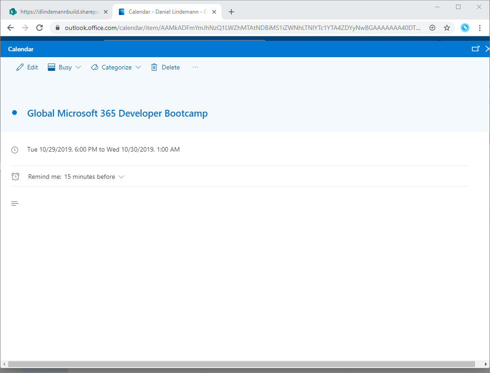

# SharePoint Framework Training
## Lab 5 - Microsoft Graph - Termin erstellen

Das SharePoint Framework ermöglicht dir auch den Zugriff auf Office 365 Daten über den Microsoft Graph. In diesem Beispiel erweiterst du den WebPart um eine Terminteilnahme. Benutzer können an einem Event teilnehmen und es wird durch einen klick ein Termin im Kalender des Benutzers erstellt.

## Kalendereintrag erstellen

Um einen Kalendereintrag für den Benutzer zu erstellen erweiterst du das Interface `IEventsService` um die Funktion `addEventToCalendar()`. Die Funktion implementierst du dann im `MockEventsService` und im `SPEventsService`.

### IEventsService.ts erweitern
```typescript
export interface IEventsService {
  get(): Promise<IEventItem[]>;
  addEventToCalendar(event: IEventItem): Promise<any>;
}
```

### MockEventsService.ts erweitern
```typescript
public addEventToCalendar(event: IEventItem): Promise<any> {
    return Promise.reject(`You're in the local workbench and can't add events to your calendar. (event ID: ${event.ID})`);
}
```

### SPEventsService.ts erweitern
```typescript
public addEventToCalendar(event: IEventItem): Promise<any> {
  return new Promise<any>((resolve, reject) => {
    debugger;
    this.context.msGraphClientFactory.getClient()
      .then((client) => {
        client.api('me/events')
          .version('v1.0')
          .post({
            subject: event.Title,
            start: {
              datetime: event.StartDate instanceof Date ? (event.StartDate as Date).toISOString() : event.StartDate,
              timezone: 'UTC'
            },
            end: {
              datetime: event.EndDate instanceof Date ? (event.EndDate as Date).toISOString() : event.EndDate,
              timezone: 'UTC'
            }
          })
          .then((res) => {
            resolve(res);
          })
          .catch((err) => {
            reject(err);
          });
      });
  });
}
```

## UI um 'Join'-Link erweitern

In der Events Tabelle wird eine neue Spalte hinzugefügt und ein Join-Link angezeigt.

### EventList.tsx erweitern
```typescriptreact
export default class EventList extends React.Component<IEventListProps, {}> {
  public render(): React.ReactElement<IEventListProps> {
    return (
      <div className={styles.eventList}>
        <div className={styles.container}>
          <div className={styles.row}>
            <table>
              <tbody>
                <tr>
                  <th>Event</th>
                  <th>Start Date</th>
                  <th>End Date</th>
                  <th>Join</th>
                </tr>
                {this.props.items &&
                  this.props.items.map(item => {
                    return (
                      <tr key={item.ID}>
                        <td>{item.Title}</td>
                        <td>{item.StartDate}</td>
                        <td>{item.EndDate}</td>
                        <td><a href={'/add/' + item.ID} onClick={ (e) => { e.preventDefault(); this.addToCalendar(item.ID); } }>join</a></td>
                      </tr>
                    );
                  })}
              </tbody>
            </table>
          </div>
        </div>
      </div>
    );
  }

  public addToCalendar(itemId: number) {
    const item = find(this.props.items, { ID: itemId });
    this.props.eventsService.addEventToCalendar(item)
      .then((calendarEvent) => {
        console.log(calendarEvent);
      })
      .catch((err) => {
        console.log(err);
      });
  }
}
```

### IEventListProps.ts erweitern
```typescript
export interface IEventListProps {
  description: string;
  items: IEventItem[];
  eventsService: IEventsService;
}
```

### EventsListWebPart render()-Methode erweitern
```typescript
public render(): void {
  this.eventsService.get()
    .then((events) => {
      Log.info('EventListWebPart', `Got ${events ? events.length : 0} events`, this.context.serviceScope);

      const element: React.ReactElement<IEventListProps > = React.createElement(
        EventList,
        {
          description: this.properties.description,
          items: events,
          eventsService: this.eventsService
        }
      );

      ReactDom.render(element, this.domElement);
    })
    .catch((err) => {
      this.context.statusRenderer.renderError(this.domElement, err.message ? err.message : 'Unable to get event data');
      Log.warn('EventListWebPart', err.message, this.context.serviceScope);
    });
}
```

## Zugriff auf Office 365 konfigurieren

### Permission konfigurieren

Hast du den Code angepasst müssen noch diese Einstellung in der Datei `package-solution.json` aus dem Ordner `config` gemacht werden. Füge dem Knoten `solution` den Knoten `webApiPermissionRequests` mit diesen Werten hinzu:

```json
"webApiPermissionRequests": [
  {
    "resource": "Microsoft Graph",
    "scope": "User.ReadBasic.All"
  },
  {
    "resource": "Microsoft Graph",
    "scope": "Calendars.ReadWrite"
  }
]
```

Diese Einstellungen erlaubt es, dass neue Kalendereintrage für den Benutzer erstellt werden dürfen.

### Permissions erteilen

Dieser Punkt ist ein bisschen unschön. Damit du die Berechtigungen erteilen kannst, musst du ein neues SPFx-Package erstellen. Also:
```powershell
gulp bundle --ship; gulp package-solution --ship
```
(mit der PowerShell)

Deploye die `sppkg`-Datei wieder wie in [Lab 4](./spfx-lab-4.md) beschrieben. Diesmal bekommst du beim Deployment die Meldung, dass du über das API Management die Permissions für `User.ReadBasic.All` und `Calendars.ReadWrite` erteilen musst. Klicke auf Deploy.



### API Management

Wechsele auf die SharePoint Admin Seite. Im Menü auf der Linken Seite findest du den Punkt `API Management`.

Hier findest du die `Pending approvals`. Bestätige die beiden Permissions.



## Testen

Starte `gulp serve` und öffne die SharePoint Workbench unter `https://<deine Teamsite>/_layouts/workbench.aspx`. Klicke auf den `join`-Link und prüfen deinen Outlook Kalender. Du findest den Termin 😊.



<sub>[Code zum Projekt](../src/lab5)</sub>