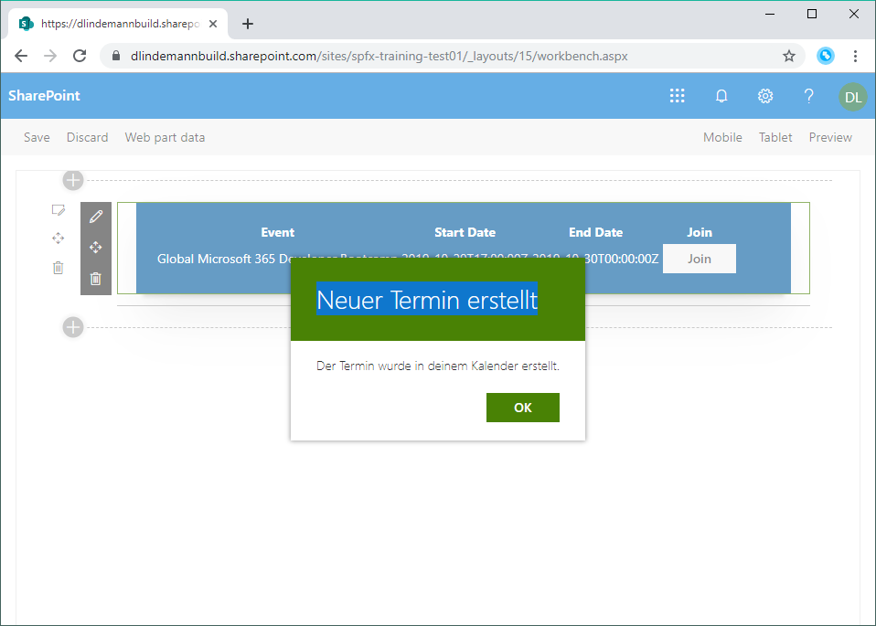

# SharePoint Framework Training
## Lab 6 - Office UI Fabric

Zeit für ein wenig Farbe und UI. Mit der [Office UI Fabric](https://developer.microsoft.com/en-us/fabric#/) stellt Microsoft fertige UI-Komponenten bereit die in ein SPFx-Projekt problemlos eingebaut werden können. Diese helfen dem WebPart mehr SharePoint "native" auszusehen.

## Join-Button
Aus dem 'Join'-Link kannst du einen wunderschönen [Button](https://developer.microsoft.com/en-us/fabric#/controls/web/button) machen. Ändere dafür die Datei `EventList.tsx` und ersetze  die Zeile 
```typescriptreact
<td><a href={'/add/' + item.ID} onClick={ (e) => { e.preventDefault(); this.addToCalendar(item.ID); } }>join</a></td>
```
mit dieser
```typescriptreact
<td><DefaultButton text="Join" href={'/add/' + item.ID} onClick={ (e) => { e.preventDefault(); this.addToCalendar(item.ID); } } /></td>
```
Damit der Code funktioniert muss du noch den `DefaultButton` von der `office-ui-fabric-react`-Bibliothek in die React-Komponente importieren.
```typescript
import { DefaultButton } from 'office-ui-fabric-react';
```

## Erfolgsmeldung

Momentan erhälst du noch keine Erfolgsmeldung, wenn du ein Event zu deinem Kalender hinzufügst. Lass uns das ändern 😊.

Für eine Erfolgsmeldung benutzt du die Office UI Fabric Komponente `Dialog`. Diesmal muss neben der Office UI Fabric Komponente ansich noch ein State in die `EventList`-Komponente hinzugefügt werden.

### State erweitern
Damit die `EventList`-Komponente weiß wie der State aussieht, erweiterst du die Deklaration der Komponente von
```typescript
export default class EventList extends React.Component<IEventListProps, {}> {
  ...
}
```
zu
```typescript
export default class HelloWorld extends React.Component<IHelloWorldProps, IEventListState {
  ...
}
```
Das neue Interface deklarierst du einfach in der gleichen Datei.
```typescript
export interface IEventListState {
  hideDialog: boolean;
  dialogTitle: string;
  dialogMessage: string;
}
```

Erweitere die Klasse `EventList` um einen Konstrukor um den initialen Zustand des States zu definieren.
```typescript
constructor(props) {
  super(props);

  this.state = {
    hideDialog: true,
    dialogTitle: null,
    dialogMessage: null
  };
}
```

### Dialog hinzufügen

Füge nach der `<table>` in der `render()`-Methode den `Dialog` hinzu.
```typescriptreact
<Dialog hidden={this.state.hideDialog} onDismiss={this.closeDialog} dialogContentProps={{
  type: DialogType.largeHeader,
  title: this.state.dialogTitle,
  subText: this.state.dialogMessage
}} modalProps={{isBlocking: false, containerClassName: 'ms-dialogMainOverride'}}>
  <DialogFooter>
    <PrimaryButton onClick={this.closeDialog} text="OK"/>
  </DialogFooter>
</Dialog>
```
und importiere die Referenz auf die Office UI Fabric Komponenten.
```typescript
import { Dialog, DialogFooter, DialogType } from 'office-ui-fabric-react/lib/Dialog';
```
Damit die `EventList` weiter funktioniert, musst du noch den Callback `closeDialog` implementieren. Füge diesen Code hinzu um die Funktion zu definieren:
```typescript
public closeDialog = ():void => {
  this.setState({ hideDialog: true });
}
```

### Anzeigen des Dialogs nach Erstellung des Kalendereintrags

In der Funktion `addToCalendar()` in der `EventList`-Komponente setzt du nun den Status zum Anzeigen einer Infomeldung. Dafür setzt du die Properties `hideDialog`, `dialogTitle` und `dialogMessage`.


#### Funktion `addToCalendar()` erweitern
```typescript
public addToCalendar(itemId: number) {
  const item = find(this.props.items, { ID: itemId });
  this.props.eventsService.addEventToCalendar(item)
  .then((calendarEvent) => {
    this.setState({
      hideDialog: false,
      dialogTitle: 'Neuer Termin erstellt',
      dialogMessage: `Der Termin wurde in deinem Kalender erstellt.`
    });
  })
  .catch((err) => {
    this.setState({
      hideDialog: false,
      dialogTitle: 'Error',
      dialogMessage: 'Termin konnte nicht erstellt werden. Bitte wende dich an deinen Administrator.'
    });
  });
}
```



<sub>[Code zum Projekt](../src/lab6)</sub>
