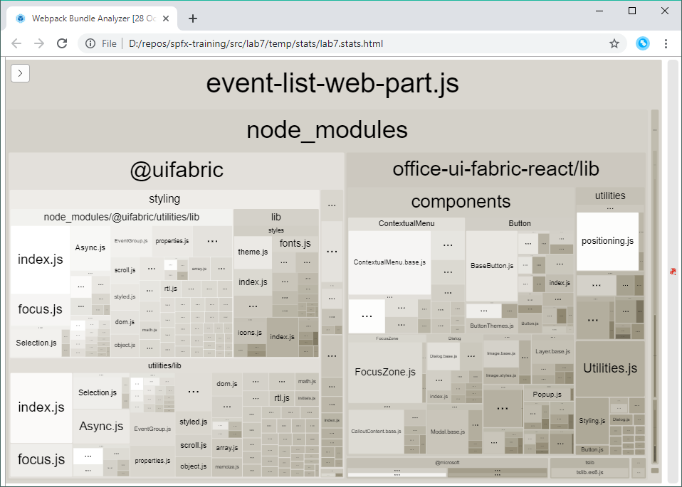

# SharePoint Framework Training
## Lab 7 - Build-Process erweitern

Du kannst während des Bauens des SPFx-Projekts in den Build/Bundle-Prozess eingreifen. In diesem Beispiel ergänzt du den Build Prozess um den `webpack-bundle-analyzer` und erhälst Informationen zu der Größe und Zusammensetzung deines SPFx-Bundles.

## gulpfile.js erweitern

Das Bundlen der JavaScript-Dateien wird von gulp ausgeführt. Deshalb musst du die gulpfile erweitern.

Installiere den Webpack Bundle Analyzer in das Projekt.

```
npm i webpack-bundle-analyzer --save-dev
```

Öffne die Datei `gulpfile.js` und füge diesen Code vor der Zeile `build.initialize(gulp);` ein:

```js
build.configureWebpack.mergeConfig({
  additionalConfiguration: function(generatedConfiguration) {
    const lastDirName = path.basename(__dirname);
    const dropPath = path.join(__dirname, 'temp', 'stats');
    generatedConfiguration.plugins.push(new bundleAnalyzer.BundleAnalyzerPlugin({
      openAnalyzer: false,
      analyzerMode: 'static',
      reportFilename: path.join(dropPath, `${lastDirName}.stats.html`),
      generateStatsFile: true,
      statsFilename: path.join(dropPath, `${lastDirName}.stats.json`),
      logLevel: 'error'
    }));

    return generatedConfiguration;
  }
});
```

Danach musst du noch die Referenz zu den benötigten Bibliotheken zur Datei hinzufügen:
```js
const path = require('path');
const bundleAnalyzer = require('webpack-bundle-analyzer');
```

Führst du nun den Befehl `gulp bundle` in der Konsole aus, erstellt dir der Bundle-Prozess die Stats zum Bundling im Ordner `temp/stats`. Du kannst die HTML-Datei mit einem Browser öffnen und siehst aus welchen Bibliotheken sich dein JavaScript-Bundle zusammensetzt.



<sub>[Code zum Projekt](../src/lab7)</sub>
