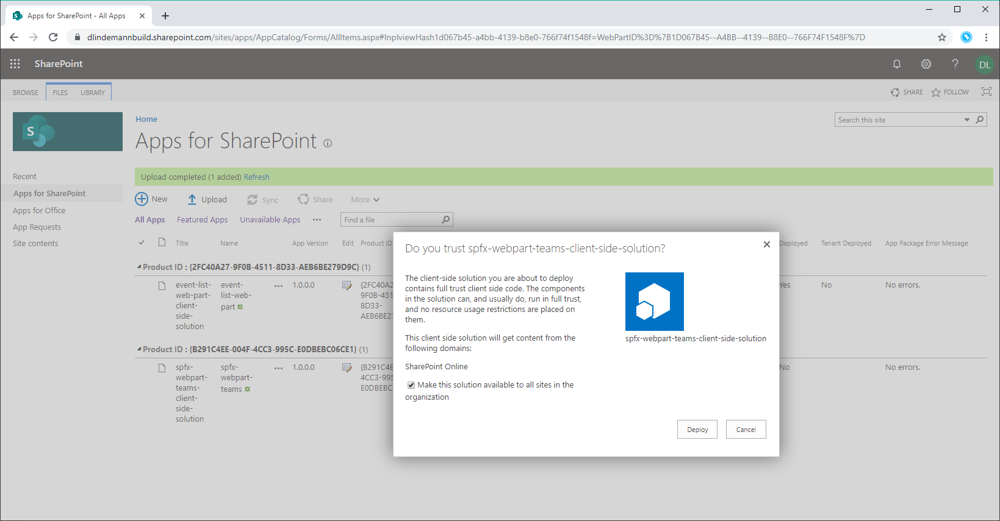
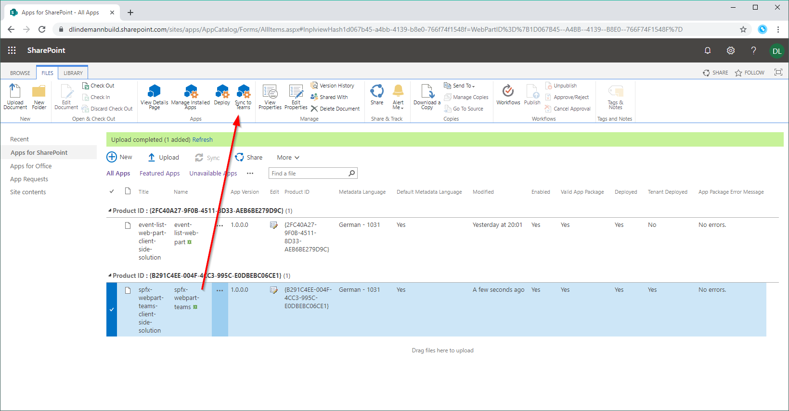
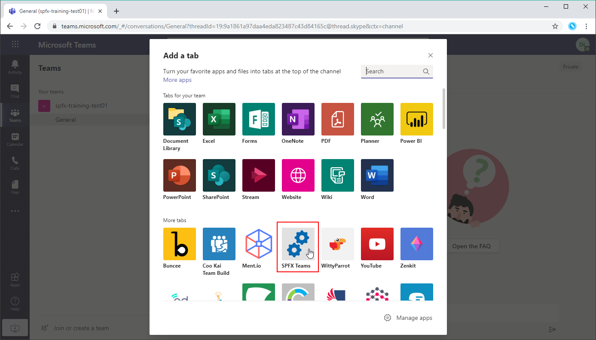
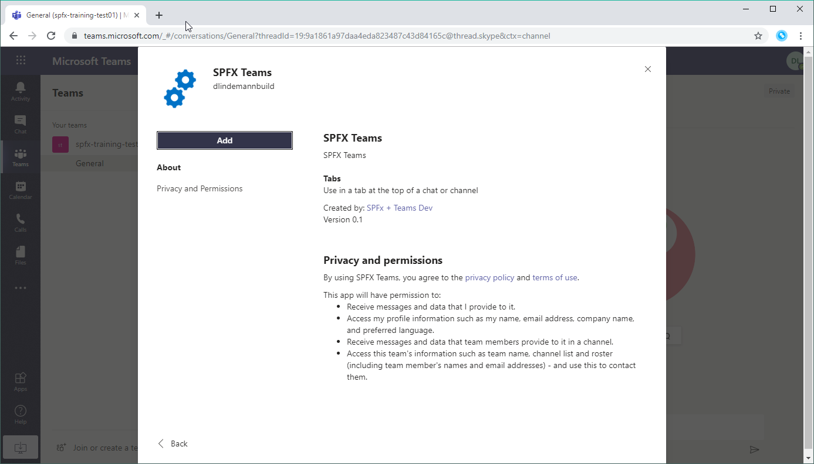
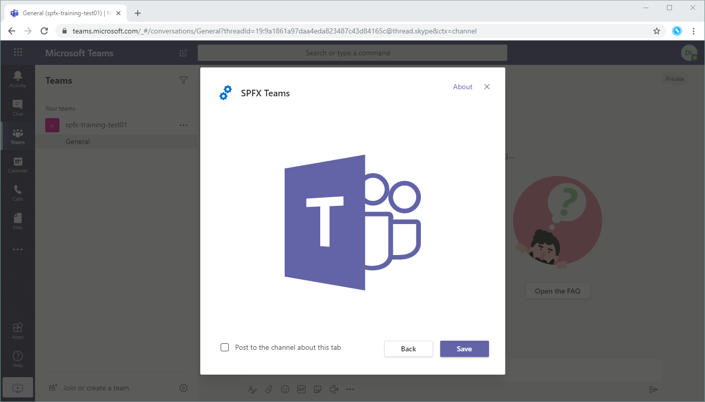
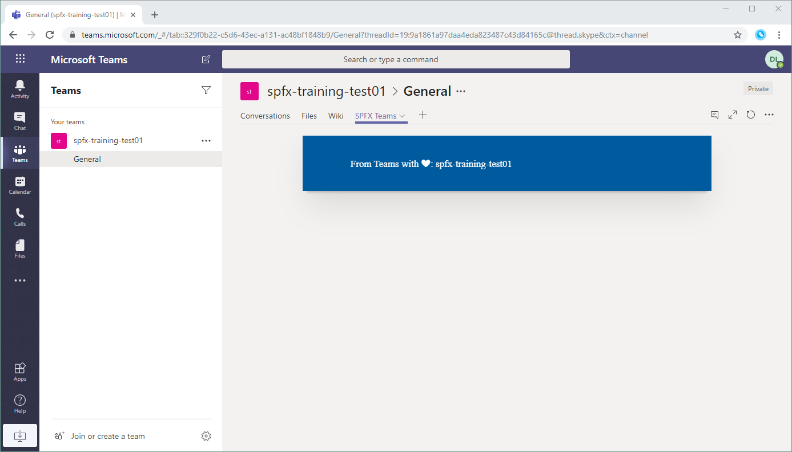

# SharePoint Framework Training
## EXTRA: Lab 8 - SPFx WebPart in Microsoft Teams

Das SharePoint-Framework ermöglicht es dir auch einen WebPart zu erstellen und in Microsoft Teams zu benutzen.

## Neues Projekt
Erstelle dafür ein neues WebPart-Projekt wie in [Lab 1](./spfx-lab-1.md) beschrieben. Nenne die Solution `spfx-webpart-teams` und den WebPart `SPFX Teams`.

## SharePoint Manifest erweitern

Öffne die Datei `SpfxTeamsWebPart.manifest.json` im Ordner `src/webparts/spfxTeams` und füge den Wert `TeamsTab` zur Auflistung `supportedHosts` hinzu.

```json
{
  "$schema": "https://developer.microsoft.com/json-schemas/spfx/client-side-web-part-manifest.schema.json",
  "id": "8fff9c87-77c6-4bb8-a0a9-73fb443c1540",
  "alias": "SpfxTeamsWebPart",
  "componentType": "WebPart",

  // The "*" signifies that the version should be taken from the package.json
  "version": "*",
  "manifestVersion": 2,

  // If true, the component can only be installed on sites where Custom Script is allowed.
  // Components that allow authors to embed arbitrary script code should set this to true.
  // https://support.office.com/en-us/article/Turn-scripting-capabilities-on-or-off-1f2c515f-5d7e-448a-9fd7-835da935584f
  "requiresCustomScript": false,
  "supportedHosts": ["SharePointWebPart", "TeamsTab"],

  "preconfiguredEntries": [{
    "groupId": "5c03119e-3074-46fd-976b-c60198311f70", // Other
    "group": { "default": "Other" },
    "title": { "default": "SPFX Teams" },
    "description": { "default": "SPFX Teams description" },
    "officeFabricIconFontName": "Page",
    "properties": {
      "description": "SPFX Teams"
    }
  }]
}
```

## WebPart Code um Teams Kontext erweitern

Öffne die Datei `SpfxTeamsWebPart.ts` und implementiere die Methode `onInit()`.

```typescript
protected onInit(): Promise<any> {
  let promise = Promise.resolve();
  if(this.context.microsoftTeams) {
    promise = new Promise((resolve, reject) => {
      this.context.microsoftTeams.getContext((ctx) => {
        this._msTeamsContext = ctx;
        resolve();
      });
    });
  }
  return promise;
}
```

Füge der Klasse `SpfxTeamsWebPart` noch die Property `_msTeamsContext` hinzu.

```typescript
private _msTeamsContext: Context;
```

Erweitere das Interface `ISpfxTeamsProps` um die Property `title`.
```typescript
title: string;
```

Passe die Funktion `render()` in der WebPart-Klasse `SpfxTeamsWebPart.ts` wie folgt an:
```typescript
public render(): void {
  let title;
  if(this._msTeamsContext) {
    title = `From Teams with ❤: ${this._msTeamsContext.teamName}`;
  }
  else {
    title = `From SharePoint with ❤: ${this.context.pageContext.web.title}`;
  }

  const element: React.ReactElement<ISpfxTeamsProps> = React.createElement(
    SpfxTeams,
    {
      title: title,
      description: this.properties.description
    }
  );

  ReactDom.render(element, this.domElement);
}
```
Öffne die Datei `SpfxTeams.tsx` und ersetze alles innerhalb des `div` mit der Klasse `column` mit diesem Code:
```typescriptreact
<p className={ styles.description }>{escape(this.props.title)}</p>
```

## Solution erstellen

Um eine Solution zu erstellen fühst du diese Befehle in einer Konsole aus.

```
gulp build
gulp bundle --ship
gulp package-solution --ship
```

Du findest die `sppkg`-Datei im Ordner `sharepoint/solution`.

## Deployment

Gehe mit einem Browser auf die SharePoint Online Admin Seite und wechsele dann auf `More Features > Apps > Open > App Catalog`. Öffne die Liste `Apps for SharePoint`.

Nun lädst du die `sppkg`-Datei in die Bibliothek `Apps for SharePoint` hoch. Du wirst nochmal gefragt, ob du die Solution wirklich deployen willst. Natürlich willst du das 😉.

Setze zusätzlich das Häkchen `Make this solution available to all sites in the organization`.



## WebPart in Teams bereitstellen

Markieren das Paket im App Catalog und wähle im Ribbon den Punkt `Sync to Teams` aus.



## WebPart zu Teams Channel hinzufügen

Öffne einen Channel in Teams und klicke auf das `+` im Channel um einen Tab hinzuzufügen. Scrolle zu dem Punkt `More tabs`.  Hier findest du den Eintrag `SPFX Teams`. Wähle den WebPart aus.



Bestätige die Permissions für den WebPart.



Bestätige nochmals mit einem Klick auf 'Save'.



Der WebPart steht nun in Teams bereit und gibt den Namen des Channels aus.


